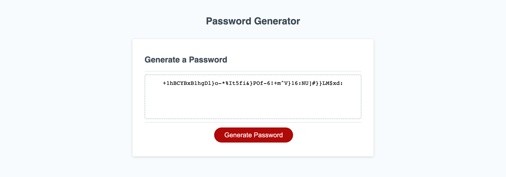

# Password-Generator

## Description

The objective and reason for this project was to use Javascript to give life to a password-generating application that responded with the user in order to provide them with a secure and unique password. It solves the problem of having to randomly think of a random password and generate one that can be copied and save somewhere secure for easy access to it. I learn that through simple prompts and boolean expression JavaScript can be quite powerful and intuitive. 

## Table of Contents 

- [Installation](#installation)
- [Usage](#usage)
- [Credits](#credits)

## Installation

N/A 

## Usage

   

## Credits

David R.

